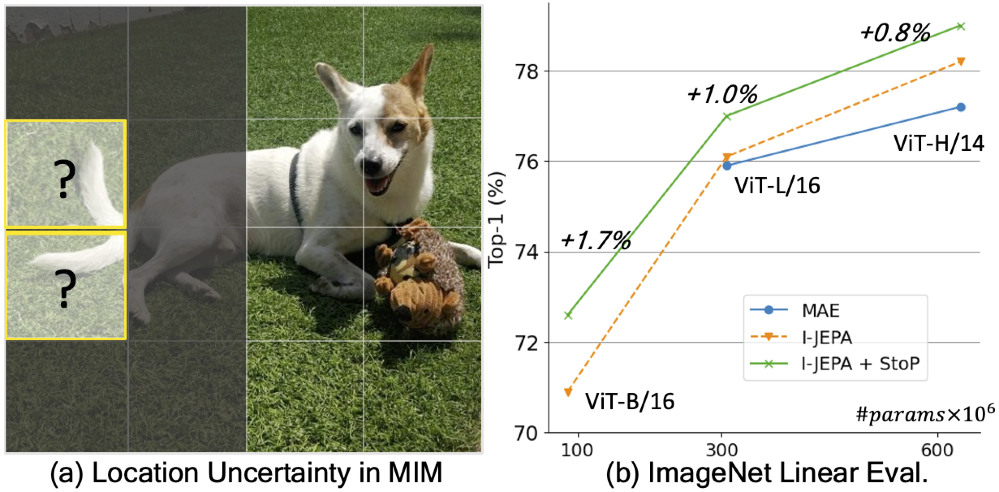

# Stochastic positional embeddings improve masked image modeling (ICML 2024)
### [Amir Bar](https://amirbar.net), [Florian Bordes](https://scholar.google.ca/citations?user=OADfWhUAAAAJ&hl=fr), [Assaf Shocher](https://assafshocher.github.io/), [Mahmoud Assran](https://www.midoassran.ca/), [Pascal Vincent](https://mila.quebec/en/pascal-vincent), [Nicolas Ballas](https://scholar.google.com/citations?user=euUV4iUAAAAJ&hl=en), [Trevor Darrell](https://people.eecs.berkeley.edu/~trevor/), [Amir Globerson](https://cs3801.wixsite.com/amirgloberson), [Yann LeCun](http://yann.lecun.com/)
  
This repository is the official implementation of [StoP](https://arxiv.org/abs/2308.00566).

## Introduction



Given a partial image of a dog, can you precisely determine the location of its tail? Existing Masked Image Modeling (MIM) models like MAE and I-JEPA predict tokens deterministically and do not model location uncertainties (a), we propose to predict the target (masked tokens) in stochastic positions (StoP) which prevents overfitting to locations features. StoP leads to improved MIM performance on downstream tasks, including linear probing on ImageNet (b).

## Installation

Please follow the installation instruction from the [I-JEPA](https://github.com/facebookresearch/ijepa) repo.

## Usage

### Pretraining on ImageNet

The commands for pretraining I-JEPA + StoP. In the original setting, all models were trained using 4 V100 GPU nodes. ViT-B/L were trained with float32 while ViT-H is trained on half precision (float16). 


Training command:

```bash
torchrun --nnodes=4 --nproc-per-node=8 --node_rank=<node_rank 0-3> --master_addr=<master_addr> --master_port=<master_port> --backend=nccl main.py --fname configs/pretrain/vit-b16.yaml
```

* Prior to running, set the path to imagenet (image_folder, root_folder) in the config file.
* to train ViT-L/ViT-H change vit-b16 to vit-l16/vit-h16.
* We --node_rank as 0 on the first node. On other nodes, run the same command with --node_rank=1,...,3 respectively. --master_addr is set as the ip of the node 0.

### Linear probing eval on ImageNet with 1% of labels (fast)

```bash
python logistic_eval.py \
  --subset-path imagenet_subsets1/1percent.txt \
  --root-path /path/to/datasets --image-folder imagenet_folder/ \
  --device cuda:0 \
  --pretrained /path/to/checkpoint/folder \
  --fname checkpoint_name.pth.tar \
  --model-name deit_base \
  --patch-size 16 \
  --penalty l2 \
  --lambd 0.0025
```

### Linear probing classification eval using [VISSL](https://github.com/facebookresearch/vissl)

To perform linear probing on ImageNet, you can follow instruction from [VISSL](https://github.com/facebookresearch/vissl/blob/main/GETTING_STARTED.md). Alternatiely, we provide a bash script to convert checkpoints to vissl format and launch experiments on 8 V100 machines each with 8 gpus on SLURM:

```bash
bash bash/in1k_eval_vissl.sh <output_dir> <checkpoint_path> <dataset_root> <arch>
```

- arch is vitb, vitl or vitb.
- checkpoint path is the full path to the checkpoint saved durning training
- dataset_root is the path to imagenet folder. 

### Pretrained Models Zoo

| Arch.   | Dataset   |  Epochs  | Checkpoint    |
| --------- | ----------- | ---------- | --------------- |
| ViT-B/16 | ImageNet | 600      | [link](https://huggingface.co/amirbar1/StoP/resolve/main/vit-b16.pth.tar?download=true)      |
| ViT-L/16 | ImageNet | 600      | [link](https://huggingface.co/amirbar1/StoP/resolve/main/vit-l16.pth.tar?download=true)      |
| ViT-H/16 | ImageNet | 300      | [link](https://huggingface.co/amirbar1/StoP/resolve/main/vit-h16.pth.tar?download=true)      |


### Differences compared to the official I-JEPA implementation
 
- I-JEPA was trained using bfloat16 which is supported in new nvidia gpus (e.g, A100, H100) and beneficial to stabilize training. Here we used older gpus hence used float32 for the smaller models ViT-B/L and float16 for ViT-H.
- For ViT-H training, we deviated from the cosine LR schedule after 250 epochs and continued training with fixed low learning rate to push performance.
- StoP relies on a previous internal implementation of I-JEPA which utilized additional image augmentations compared to the [official repo](https://github.com/facebookresearch/ijepa). The main difference is the use of hflip, gaussian blur and random grayscale during training. In the ablation experiments (Figures 3-4, Tables 5-6 & 8) we compare different positional embeddings using this same set of augmentations.

## Acknowledgments
The codebase relies on the implementation of I-JEPA.

## Citation
If you found this code helpful, feel free to cite our work: 

```bibtext
@inproceedings{barstochastic,
  title={Stochastic positional embeddings improve masked image modeling},
  author={Bar, Amir and Bordes, Florian and Shocher, Assaf and Assran, Mido and Vincent, Pascal and Ballas, Nicolas and Darrell, Trevor and Globerson, Amir and LeCun, Yann},
  booktitle={Forty-first International Conference on Machine Learning}
}```